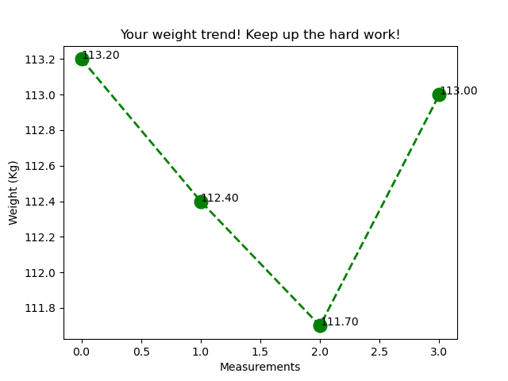

# weightmanager
Weight Manager is an application that I developed to track my weight and BMI (Body Mass Index), since I have over weight. It uses a MySQL database for keeping track of my weight history. The application shows a plot of all historic weights over time.

I did this project as a way to keep my coding skills sharp and because I needed a way to keep track of my efforts to lost weight!

Technologies used:
* Python 3
* MySQL 8.0
* Matplotlib

You can also visualize with the help of a graph, how are you doing with all that hard work. See the trend of your weight historically.

![Tracking your weight]

